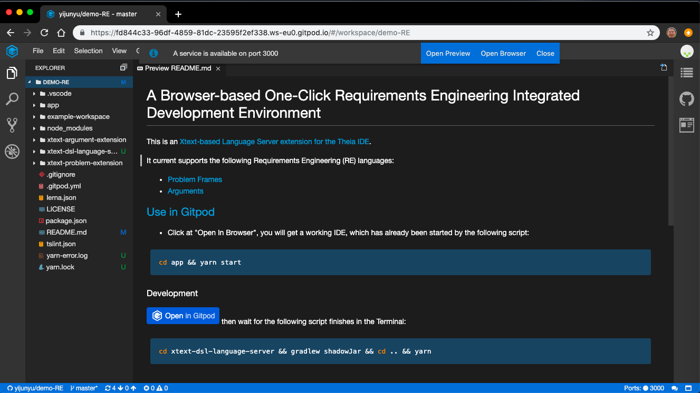
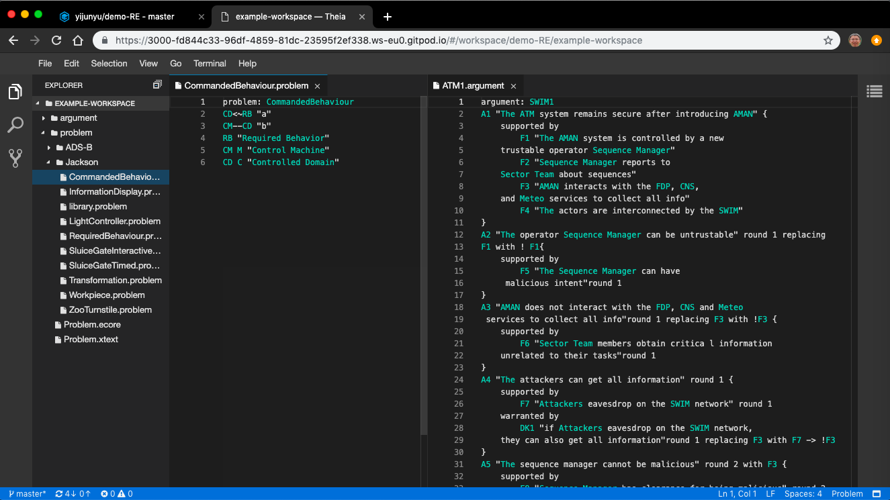

# An [One-Click IDE](https://gitpod.io#snapshot/96178943-ced5-4aa9-ad96-dee0131c8772) for Requirements Engineering (RE)

* Click at "Open Browser" button on the top of the page, 
  a Visual Studio Code IDE will run inside your browser. 

<font size="2"><b>Note.</b> <i>If it is your first time using the GitPod app, first authenticate it to access your GitHub account. You will get 100 hours free use of the machine every month from this account.</i></font>

[](https://gitpod.io#snapshot/96178943-ced5-4aa9-ad96-dee0131c8772)

* Click at the folders on the navigator, you will see editable examples of the following RE languages. You can easily open multiple examples to edit side-by-side.



More examples see:

1. [Problem Frames](example-workspace/problem)
1. [Satisfaction Arguments](example-workspace/argument)

## Development

This is based on an [Xtext-based Language Server extension for the Theia IDE](https://github.com/theia-ide/theia-xtext).

[](https://gitpod.io/#https://github.com/yijunyu/demo-RE)
then wait for the following script finishes in the Terminal:
```bash
cd xtext-dsl-language-server && gradlew shadowJar && cd .. && yarn
cd app && yarn start
```
